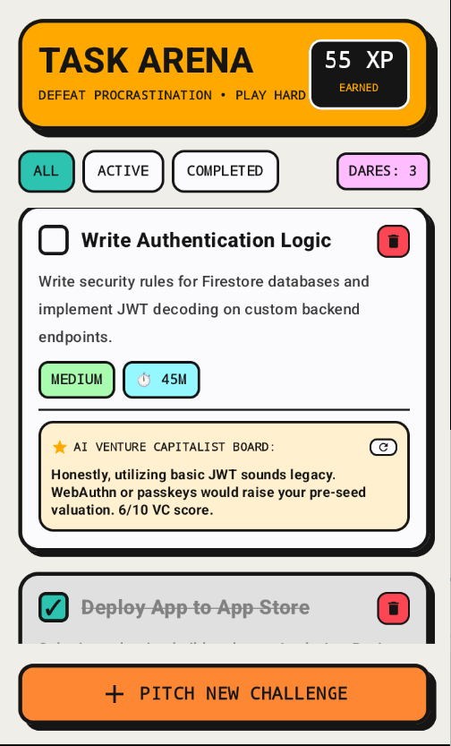

# 🛡️ Task Arena: Gamified Productivity System

<div align="center">
  **"Defeat Procrastination • Play Hard • Level Up Your Life"**
  
  *A high-performance Android application built with Jetpack Compose, MVI Architecture, and Gemini AI integration.*
</div>

---

## 🚀 The Vision

**Task Arena** transforms the mundane ritual of task management into a high-stakes "Arena". Designed for developers and power users, it treats every task as a **"Dare"**. Complete challenges, earn XP, and face the brutal honesty of the **AI Venture Capitalist Board**—an integrated AI that reviews your technical dares and gives you a professional "reality check" or a "VC-style roast".

### 🎨 Design Philosophy: Neo-Brutalism
The app features a custom-built **Neo-Brutalism** design system. Unlike standard Material apps, Task Arena uses:
- **Bold Strokes:** Thick black borders for high visibility and a unique "comic-book" aesthetic.
- **Hard Shadows:** Pronounced, non-blurred shadows that create a strong 3D effect.
- **Vibrant Palette:** A punchy mix of NeoBg, NeoOrange, and NeoCyan that demands focus and action.

---

## 📸 Screen Showcase

<div align="center">
  
  <p><i>The Arena Dashboard: Tracking XP and conquering Dares with AI-powered feedback.</i></p>
</div>

---

## 🛠️ Technical Excellence

This project was developed to demonstrate proficiency in modern Android development standards:

-   **Architecture**: **MVI (Model-View-Intent)** with Unidirectional Data Flow.
    -   Predictable state management using `StateFlow` and `SharedFlow`.
    -   Clean separation between Domain logic and UI presentation.
-   **UI Layer**: 100% **Jetpack Compose**.
    -   Custom Design System implementation (Colors, Shapes, Typography).
    -   Advanced UI components: Custom cards, progress chips, and interactive bottom sheets.
-   **AI Integration**: **Google Generative AI (Gemini)**.
    -   Context-aware prompt engineering to analyze task feasibility and provide "VC-style" feedback.
-   **Persistence & Networking**: 
    -   **Room Database** for local persistence and offline-first reliability.
    -   **Retrofit & Moshi** for robust API communication.
-   **Modern Tooling**:
    -   **Kotlin Coroutines & Flow** for reactive programming.
    -   **Version Catalogs** (libs.versions.toml) for professional dependency management.
    -   **Secrets Gradle Plugin** for secure API key management.

---

## 🏗️ Project Structure

```text
app/src/main/java/com/example/
├── data/           # Repositories, Room DB, and AI Service implementations
├── domain/         # Pure Business Logic, Interfaces, and Models
├── presentation/   # UI Layer (MVI Pattern)
│   ├── screen/     # Screen Composables and ViewModels
│   └── component/  # Atomic UI components (The Neo-Brutalism core)
└── ui/theme/       # Custom Theme & Styling (Color, Shape, Type)
```

---

## ⚙️ Quick Start

### Prerequisites
- Android Studio Ladybug (2024.2.1) or newer.
- A Gemini API Key from [Google AI Studio](https://aistudio.google.com/).

### Installation
1. Clone the repository.
2. Create a `.env` file in the root directory.
3. Add your key: `GEMINI_API_KEY=your_actual_key`
4. Sync Gradle and hit **Run**.

---

<div align="center">
  <p>Developed with ❤️ and technical rigor by <b>Dthuy</b></p>
  <p>
    <a href="https://github.com/dthuy"></a>
    <a href="https://linkedin.com/in/dthuy"></a>
  </p>
</div>
